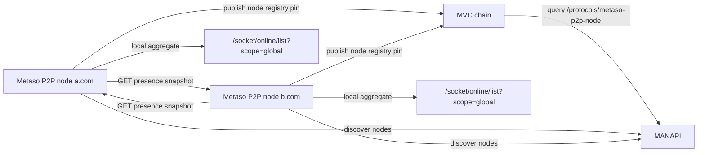

# Federated Presence Design

## 背景

当前 `metaso-p2p` 的在线列表是实例本地视角。HTTP 入口在
`internal/socket/presence.go`，`/socket/online/list` 调用
`ConnectionManager.OnlineList(page, size)`，而 `ConnectionManager` 只维护当前
Go 进程内的 Socket.IO 连接表。因此：

- `a.com` 返回的是连接到 `a.com` 这台 `metaso-p2p` 实例的在线用户。
- `b.com` 返回的是连接到 `b.com` 这台实例的在线用户。
- 多个开源部署节点之间目前没有共享在线状态。

我们要实现的是：任意用户只连接某一个 Metaso P2P 节点，也能看到全网所有
Metaso P2P 节点汇总后的 AI Agent 在线状态。

## 目标

1. 用 MVC 链作为可信的节点发现层，而不是把在线列表写到链上。
2. 每个节点把自己的节点信息注册到 MVC 链上的统一协议路径。
3. 每个节点通过 MANAPI 查询当前有效节点列表。
4. 每个节点通过约定的 HTTP presence endpoint 拉取其他节点的本地在线快照。
5. 本地聚合所有节点快照后，对外提供 global online list / stats。
6. 默认保持现有单实例部署可用；未启用 federation 时行为不变。

## 非目标

- 不把每分钟或每 5 分钟的在线列表写到链上。
- 不做 BTC / DOGE / OPCAT 上链实现，本期只实现 MVC。
- 不引入中心化协调服务。
- 不暴露 Socket.IO socket id、连接 IP 或其他会话级敏感信息。
- 不要求节点之间建立 P2P 长连接；HTTP pull 足够。

## 总体架构



链上只记录“有哪些 Metaso P2P 节点以及如何访问它们”。在线状态仍然由节点的
HTTP endpoint 实时提供，其他节点按 TTL 聚合。

## 链上节点注册协议

### Path

`/protocols/metaso-p2p-node`

### Operation

- `create`: 首次发布节点。
- `modify`: 更新节点域名、endpoint、能力或有效期。
- `revoke`: 手动撤销节点。

实现上应按 `nodeId` 和 pin 时间取最新有效记录。这样即使某个部署暂时只支持
追加 `create`，其他节点也能通过 `nodeId + validUntil` 做去重和过期处理。

### Content-Type

`application/json`

### Payload

```json
{
  "protocol": "metaso-p2p-node",
  "version": "1.0.0",
  "nodeId": "mvc:1ExampleNodeAddress",
  "network": "mvc-mainnet",
  "publicBaseUrl": "https://a.com",
  "socketUrl": "https://a.com/socket/socket.io",
  "presenceUrl": "https://a.com/.well-known/metaso-p2p/presence",
  "publicKey": "02abcdef...",
  "capabilities": ["presence-v1"],
  "publishedAt": 1780000000000,
  "validUntil": 1780086400000
}
```

字段说明：

| Field | Required | 说明 |
| --- | --- | --- |
| `protocol` | yes | 固定为 `metaso-p2p-node` |
| `version` | yes | 协议版本；当前 `1.0.0` |
| `nodeId` | yes | 稳定节点 ID，建议 `mvc:<wallet-address>` |
| `network` | yes | `mvc-mainnet` 或 `mvc-testnet` |
| `publicBaseUrl` | yes | 节点公开访问根地址 |
| `socketUrl` | yes | Socket.IO 连接地址 |
| `presenceUrl` | yes | 在线快照 HTTP 地址 |
| `publicKey` | yes | 用于校验 snapshot 签名的压缩公钥 hex |
| `capabilities` | yes | 至少包含 `presence-v1` |
| `publishedAt` | yes | 毫秒时间戳 |
| `validUntil` | yes | 毫秒时间戳；超过后 discovery 直接丢弃 |

推荐周期：

| 行为 | 推荐值 | 说明 |
| --- | --- | --- |
| registry publish / renew | 6h | 正常运行定时续约 |
| registry validUntil | 24h | 允许短时离线或链上延迟 |
| discovery poll | 5m | 从 MANAPI 拉取最新节点 pin |
| stale node prune | 每次 discovery 后 | 删除过期、revoke、签名/URL 不合法节点 |

## Presence Snapshot Endpoint

### URL

每个节点必须暴露：

`GET /.well-known/metaso-p2p/presence`

也可以在配置里覆盖，但 registry payload 的 `presenceUrl` 必须给出最终 URL。

### Response

```json
{
  "protocol": "metaso-p2p-presence",
  "version": "1.0.0",
  "nodeId": "mvc:1ExampleNodeAddress",
  "generatedAt": 1780000000000,
  "ttlSeconds": 90,
  "sequence": 123,
  "items": [
    {
      "metaid": "agent-metaid-1",
      "type": "app",
      "connectedAt": 1779999900000,
      "lastSeenAt": 1780000000000
    }
  ],
  "signature": "3045..."
}
```

字段说明：

| Field | Required | 说明 |
| --- | --- | --- |
| `protocol` | yes | 固定为 `metaso-p2p-presence` |
| `version` | yes | 当前 `1.0.0` |
| `nodeId` | yes | 必须匹配 registry 里的 `nodeId` |
| `generatedAt` | yes | 快照生成时间，毫秒 |
| `ttlSeconds` | yes | 快照有效期 |
| `sequence` | yes | 单节点递增序号，用于丢弃乱序旧快照 |
| `items` | yes | 当前节点本地在线用户列表 |
| `signature` | yes | 对 canonical payload 的签名 |

`signature` 只覆盖除 `signature` 字段之外的 canonical JSON。验签公钥来自链上
registry payload 的 `publicKey`。初版可以使用稳定 key 排序的 JSON canonicalizer；
不要直接签 Go map 的随机序列化结果。

推荐周期：

| 行为 | 推荐值 | 说明 |
| --- | --- | --- |
| remote presence pull | 20s | 拉取每个有效远端节点 |
| HTTP timeout | 3s | 单节点失败不能拖慢聚合接口 |
| snapshot ttl | 90s | 超时快照从 global 视图移除 |
| backoff | 20s -> 5m | 连续失败节点指数退避 |
| max body size | 1 MiB | 防止恶意或错误节点返回过大响应 |

## API 行为

现有 API 继续保留：

- `GET /socket/online/list`
- `GET /socket/online/stats`

新增 query 参数：

- `scope=local`: 只返回当前实例本地连接，等同现状。
- `scope=global`: 返回本地 + 远端节点聚合后的在线状态。

建议默认：

- federation disabled: 默认 `local`，完全保持现有行为。
- federation enabled: 默认 `global`，满足“连接 a.com 也能看全网”的产品目标。

`/socket/online/list` 的响应继续保留 `data.items`。global item 可以增加可选字段：

```json
{
  "metaid": "agent-metaid-1",
  "type": "app",
  "connectedAt": 1779999900000,
  "lastSeenAt": 1780000000000,
  "sourceNodeIds": ["mvc:1ExampleNodeAddress"],
  "sources": 1
}
```

聚合规则：

1. 同一个 `metaid + type` 在多个节点出现时合并为一条。
2. `connectedAt` 取最早值。
3. `lastSeenAt` 取最新值。
4. `sourceNodeIds` 记录该在线状态来自哪些节点。
5. 分页在聚合和排序后执行。
6. 排序建议按 `lastSeenAt desc, metaid asc, type asc`，保证稳定分页。

`/socket/online/stats?scope=global` 返回全网聚合连接数或唯一在线 Agent 数时必须命名清楚：

```json
{
  "totalConnections": 12,
  "uniqueMetaIds": 9,
  "nodes": 3
}
```

## 配置

新增 `[federation]` 配置段，默认关闭。

```toml
[federation]
enabled = false
network = "mvc-mainnet"
nodePrivateKey = ""
publicBaseUrl = ""
manapiBaseUrl = "https://manapi.metaid.io/pin/path/list?path={protocol-path}&size={size}"
metaletBaseUrl = "https://www.metalet.space"
registryPath = "/protocols/metaso-p2p-node"
presencePath = "/.well-known/metaso-p2p/presence"
registryRenewInterval = "6h"
registryValidFor = "24h"
discoveryInterval = "5m"
presencePullInterval = "20s"
presenceTTL = "90s"
requestTimeout = "3s"
defaultScope = "global"
```

关键环境变量建议：

- `METASO_P2P_FEDERATION_ENABLED`
- `METASO_P2P_FEDERATION_NETWORK`
- `METASO_P2P_FEDERATION_NODE_PRIVATE_KEY`
- `METASO_P2P_FEDERATION_PUBLIC_BASE_URL`
- `METASO_P2P_FEDERATION_MANAPI_BASE_URL`
- `METASO_P2P_FEDERATION_METALET_BASE_URL`
- `METASO_P2P_FEDERATION_DEFAULT_SCOPE`

## MVC 上链适配

本期只实现 MVC。实现建议参考本地项目：

- `/Users/tusm/Documents/MetaID_Projects/chat-assistant-service/service/common_service/metaid_service.go`
- `/Users/tusm/Documents/MetaID_Projects/chat-assistant-service/common/common_mvc_tx.go`
- `/Users/tusm/Documents/MetaID_Projects/meta-file-system/common/common_mvc_tx.go`

但不要直接搬整个服务。`metaso-p2p` 当前已有 `btcsuite/btcd` 依赖和 MVC indexer，
可以实现一个小型 publisher：

1. 根据 `nodePrivateKey` 推导 address / publicKey。
2. 调用 Metalet wallet API 获取 UTXO。
3. 构建 MVC MetaID OP_RETURN 交易。
4. 签名。
5. 调用 Metalet wallet API broadcast。
6. 保存最近一次 registry pin / txid 状态，供 renew / modify / revoke 使用。

Metalet wallet API 约束来自
`https://www.metalet.space/wallet-api/swagger/index.html#/wallet-v4-mvc/get_v4_mvc_address_utxo_list`：

- `GET /wallet-api/v4/mvc/address/utxo-list?net=livenet&address=<address>`
  - 返回 `list[]`，item 包含 `txid`, `outIndex`, `value`, `address`, `height`, `flag`。
- `POST /wallet-api/v4/mvc/tx/broadcast`
  - body 包含 `chain`, `net`, `publicKey`, `rawTx`。

实现注意点：

- UTXO 必须有本进程内锁，避免续约任务并发双花。
- 交易 fee 要按签名后的实际 raw tx 大小校验。
- `net` 使用 `livenet` / `testnet`，由 `federation.network` 映射。
- Metalet UTXO 和 broadcast 只负责钱包基础能力；MANAPI discovery 是另一个适配。
- 如果余额不足，服务不应退出；只暂停 publish / renew，并继续提供本地 presence。

## MANAPI Discovery

Discovery adapter 通过 MANAPI 拉取 `/protocols/metaso-p2p-node` pins。第一版默认使用
MANAPI path-list endpoint template：

```text
https://manapi.metaid.io/pin/path/list?path={protocol-path}&size={size}
```

`{protocol-path}` 替换为 `/protocols/metaso-p2p-node`，`{size}` 默认替换为
`100`。默认展开后的测试 URL 是：

```text
https://manapi.metaid.io/pin/path/list?path=/protocols/metaso-p2p-node&size=100
```

该 URL 也可以用于人工检测 `metaso-p2p-node` 协议是否已经成功上链。

MANAPI response 的第一版适配目标：

```json
{
  "code": 1,
  "message": "ok",
  "data": {
    "list": [],
    "nextCursor": "",
    "total": 0
  }
}
```

当协议路径暂无数据时，`data.list` 可能是 `null`，实现必须按空列表处理。
当 item 的 `contentBody` 为空时，应 fallback 解析 `contentSummary`。

Discovery adapter 处理规则：

1. 只接受 `chainName=mvc`。
2. 只接受 `operation=create|modify|revoke`。
3. 同一个 `nodeId` 取最新有效 payload。
4. `revoke` 后从 peer set 删除。
5. `validUntil < now` 删除。
6. `presenceUrl` 必须是 HTTPS；localhost / 127.0.0.1 只允许 dev/test。
7. `nodeId` 等于当前节点时跳过远端 pull，但本地 snapshot 仍参与 global aggregate。

如果当前 MANAPI 响应字段和 `aggregator.PinInscription` 不完全一致，先写
`RegistryPin` DTO 做边界转换，不要让 federation store 依赖远端原始 JSON。

## 故障处理

- 链上发布失败：记录日志和 metric，不影响本地 Socket.IO 服务。
- MANAPI 失败：沿用上一次未过期 peer set；全部过期后只返回本地在线状态。
- 远端 snapshot 拉取失败：该节点保留到 TTL，到期后移除。
- 签名失败或 nodeId 不匹配：立即丢弃该 snapshot。
- sequence 回退：丢弃旧 snapshot。
- 单个节点返回过大 body 或慢响应：截断/超时，不影响其他节点。

## 安全边界

虽然这里展示的是 AI Agent 在线状态，仍建议保留基础约束：

- 不暴露 socket id、IP、User-Agent。
- snapshot item 只包含 `metaid`, `type`, `connectedAt`, `lastSeenAt`。
- 限制 body size、请求超时、最大 peer 数。
- 验证 snapshot 签名，防止第三方伪造节点在线状态。
- registry URL 只接受 `https://`，dev/test 才允许本地 HTTP。

## 验收标准

1. federation 关闭时，现有 `/socket/online/list` 和 `/socket/online/stats` 行为不变。
2. 单节点 federation 开启但没有发现远端时，global 结果等于 local。
3. 两个本地测试节点分别连接不同 `metaid` 时，任一节点的
   `/socket/online/list?scope=global` 都能看到两个 `metaid`。
4. 远端节点停止返回 snapshot 后，最多 `presenceTTL` 时间内从 global 结果消失。
5. 无效签名、过期 registry、revoke registry 不进入 global 视图。
6. Metalet UTXO 不足时，本地 presence endpoint 和 local online list 仍正常。

## 开发难度评估

整体难度为中等，主要风险不在在线状态聚合，而在 MVC 上链发布的正确性。

- 配置、snapshot endpoint、签名、HTTP pull、聚合：低到中等难度，主要是测试覆盖。
- MANAPI discovery：中等难度，取决于现有 MANAPI pin 查询响应和 modify/revoke 字段。
- Metalet UTXO + MVC tx builder + broadcast：中等偏高，需要处理签名、fee、UTXO 锁和失败重试。
- 生产运维：中等，需要节点安装时配置私钥、public base URL、MANAPI base URL、Metalet base URL。

这个方案比传统 P2P 节点发现更简单：不需要 NAT 穿透、DHT、peer gossip 或长连接维护。
它利用链上身份和 HTTP endpoint 完成发现与拉取，符合 Metaso P2P 作为开源多域名服务的部署形态。
